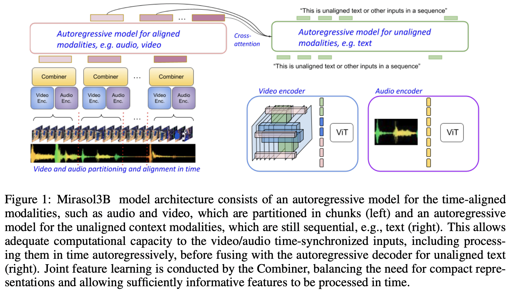

</img>

## 🌻 Mirasol - Pytorch

Implementation of <a href="https://arxiv.org/abs/2311.05698">Mirasol</a>, SOTA Multimodal Autoregressive model out of Google Deepmind, in Pytorch

Will simply implement the Transformer Combiner and omit the other variants.

## Appreciation

- <a href="https://stability.ai/">StabilityAI</a>, <a href="https://a16z.com/supporting-the-open-source-ai-community/">A16Z Open Source AI Grant Program</a>, and <a href="https://huggingface.co/">🤗 Huggingface</a> for the generous sponsorships, as well as my other sponsors, for affording me the independence to open source current artificial intelligence research

## Install

```bash
$ pip install mirasol-pytorch
```

## Usage

```python
import torch
from mirasol_pytorch import Mirasol

model = Mirasol(
    dim = 512,
    num_text_tokens = 256,
    video_image_size = 128,
    video_frames_per_timechunk = 2,
    audio_freq_dim = 64,
    audio_time_dim_per_timechunk = 32,
    audio_patch_size = (32, 16),
    video_patch_size = (64, 2),
    audio_encoder = dict(
        dim = 512,
        depth = 2
    ),
    video_encoder = dict(
        dim = 512,
        depth = 2
    )
)

audio = torch.randn(1, 64, 1024)
video = torch.randn(1, 3, 12, 128, 128)

text = torch.randint(0, 256, (1, 1024))

loss = model(
    audio = audio,
    video = video,
    text = text
)

loss.backward()

# after much training

sampled_text = model.generate(
    audio = audio,
    video = video,
    seq_len = 512
)
```

## Todo

- [x] text generation code
- [x] auto-handle start token for decoder
- [x] positional embeddings for video and audio encoder
- [x] enable register tokens for both video and audio encoder, inline with new research
- [x] add audio and video reconstruction losses
- [x] add similarity regularization from TTS research

## Citations

```bibtex
@article{Piergiovanni2023Mirasol3BAM,
    title   = {Mirasol3B: A Multimodal Autoregressive model for time-aligned and contextual modalities},
    author  = {A. J. Piergiovanni and Isaac Noble and Dahun Kim and Michael S. Ryoo and Victor Gomes and Anelia Angelova},
    journal = {ArXiv},
    year    = {2023},
    volume  = {abs/2311.05698},
    url     = {https://api.semanticscholar.org/CorpusID:265129010}
}
```

```bibtex
@inproceedings{Liu2022TowardsBF,
    title   = {Towards Better Few-Shot and Finetuning Performance with Forgetful Causal Language Models},
    author  = {Hao Liu and Xinyang Geng and Lisa Lee and Igor Mordatch and Sergey Levine and Sharan Narang and P. Abbeel},
    year    = {2022},
    url     = {https://api.semanticscholar.org/CorpusID:256416540}
}
```

```bibtex
@article{Darcet2023VisionTN,
    title   = {Vision Transformers Need Registers},
    author  = {Timoth'ee Darcet and Maxime Oquab and Julien Mairal and Piotr Bojanowski},
    journal = {ArXiv},
    year    = {2023},
    volume  = {abs/2309.16588},
    url     = {https://api.semanticscholar.org/CorpusID:263134283}
}
```

```bibtex
@article{Bondarenko2023QuantizableTR,
    title   = {Quantizable Transformers: Removing Outliers by Helping Attention Heads Do Nothing},
    author  = {Yelysei Bondarenko and Markus Nagel and Tijmen Blankevoort},
    journal = {ArXiv},
    year    = {2023},
    volume  = {abs/2306.12929},
    url     = {https://api.semanticscholar.org/CorpusID:259224568}
}
```

```bibtex
@misc{shi2023enhance,
    title   = {Enhance audio generation controllability through representation similarity regularization}, 
    author  = {Yangyang Shi and Gael Le Lan and Varun Nagaraja and Zhaoheng Ni and Xinhao Mei and Ernie Chang and Forrest Iandola and Yang Liu and Vikas Chandra},
    year    = {2023},
    eprint  = {2309.08773},
    archivePrefix = {arXiv},
    primaryClass = {cs.SD}
}
```
